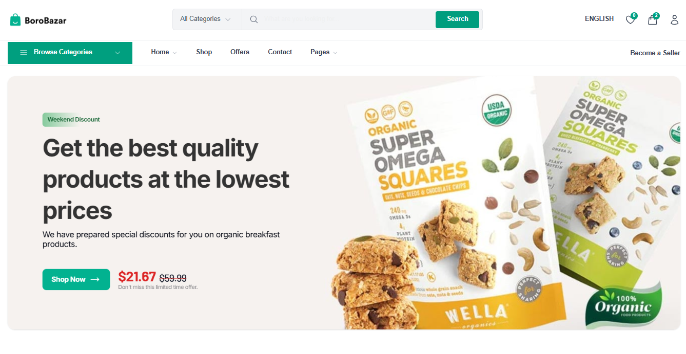

# BoroBazar E-commerce - Full-Stack Grocery Store

A highly scalable, modern, and high-performance full-stack grocery store web application built using Next.js 16 App Router, React 19, and Tailwind CSS v4. The system architecture is heavily modeled after industry-leading e-commerce standards, delivering optimized page delivery speeds, rich interactive visual aesthetics, and strict type safety.

---



## 🛠️ Technology Stack & Project Dependencies

The project leverages a robust ecosystem of modern frontend development tools and framework features:

### Core Framework & View Layer

- **Next.js 16.2.9 (App Router):** Utilizes React Server Components (RSC) by default for low client bundle footprints, alongside nested layouts, streaming, and efficient static parameter generation (`generateStaticParams`).
- **React 19.2.4:** Brings native async transition handling, modern client/server actions integration, and highly responsive rendering primitives.
- **TypeScript 5:** Strict type definitions with a zero-`any` target across all interface layers.

### Styling & UI Design System

- **Tailwind CSS v4:** Modern utility-first layout building utilizing CSS variables directly inside `@tailwindcss/postcss` for advanced customization, fast JIT compilation, and smooth brand-focused coloring (`text-brand`, `bg-brand`).
- **Material-UI (MUI v9) & Emotion:** Sparsed utility integration for underlying accessible component blocks where sophisticated enterprise layout tools or composite controls are beneficial.
- **Embla Carousel:** Light-weight, high-performance, and fluid hardware-accelerated carousel mechanism used for the main slider systems.

---

## 🏗️ Architecture Design Principles

The application is structured around a **Clean, Modular, and Scalable Component-Driven Architecture**, fully honoring the **S.O.L.I.D. design principles**:

### 1. Separation of Concerns & Rendering Split

- **RSC by Default (Server-First):** Layouts, primary catalog pages (`app/products/page.tsx`), and individual detail engines remain pure Server Components to minimize browser loading times and maximize SEO.
- **Targeted `'use client'` Interactivity:** Interactive state machines (e.g., gallery thumbnail switches, item quantity selectors, search inputs) are isolated into independent sub-components, keeping standard static nodes pure.

### 2. Directory Structure Definition

```text
C:\Eduardo\Projetos\full-stack-grocery-store\
├───app\                       # Next.js App Router (Routing, Pages, Layouts)
│   ├───products\              # Product Catalog Domain
│   │   └───[slug]\            # Dynamic Product Details page engine
│   ├───globals.css            # Global CSS Variables and Tailwind Directives
│   ├───layout.tsx             # Root template & App wrapper context
│   └───page.tsx               # Homepage Layout
├───components\                # Reusable Component Layer
│   ├───categories\            # Category Carousels & Grid Widgets
│   ├───footer\                # Unified Global Footer
│   ├───header\                # Composite Desktop/Mobile Navigation Shells
│   ├───hero\                  # Hero Banner & Promo Sliders
│   ├───products\              # Feature-specific product widgets (Cards, Grids, Details)
│   └───ui\                    # Atomic UI Design Primitives (Icons, Breadcrumbs, Logo)
├───public\                    # Static Assets (Images, SVG Logos, Vectors)
│   └───img\                   # Sourced product images & banner media assets
└───types\                     # Domain Type Safety Layer
    └───product.ts             # Strongly typed Product & Category Interfaces
```

### 3. Key Design Patterns Applied

- **Composition Over Inheritance:** Interface components are composed dynamically through structured properties, preventing coupled inheritance hierarchy layers.
- **Immutability & Pure Functions:** Product list parsing, parameter generation, and content lookups are built entirely around pure array operations (`.map`, `.filter`, `.reduce`).
- **Atomic Component Scope:** Reusable layouts (like `ProductCard` or `Breadcrumbs`) exist as atomic files capped strictly to individual responsibilities.

---

## 💎 Implemented Feature Highlights

### 🛍️ Product Catalog & Navigation Layouts

- **Responsive Header & Mobile Navbar:** Optimized sticky desktop multi-tier navigation coupled with a slide-out drawer navigation on mobile viewports.
- **Dynamic Product Listing Layout:** Comprehensive page with side-docked filter bars, mobile filter drawers, product sorting layouts, and an organic multi-row responsive item grid.

### 🔍 Specialized Product Details Page

- **Multi-Image Gallery Engine:** Seamless thumbnail switching with a dedicated primary viewport image and localized state.
- **Status & Pricing Tags:** Automated visual markers denoting pricing reductions, new additions, or fresh batches (`Sale`, `New`, `Fresh`).
- **Quantified Shopping Context:** Fluid item counters adjusting targeted buy requests before final cart ingestion.
- **Contextual Semantic Breadcrumbs:** Adaptive directional link trees mapping dynamic pages automatically back to primary catalogs.
- **Related Items Matrix:** Direct recommendation block compiling relevant domain listings from overlapping categories.

---

## 🚀 Getting Started & Local Development

### 1. Install Workspace Dependencies

Ensure you have Node.js installed (v18+ recommended) and run:

```bash
npm install
```

### 2. Launch Development Runtime

Fire up the Next.js local watch compiler:

```bash
npm run dev
```

Open [http://localhost:3000](http://localhost:3000) to view your local deployment.

### 3. Production Compilation & Optimization

Audit types, execute linter passes, and compile highly optimized standalone static chunks:

```bash
npm run build
```

To boot up the built distribution application locally:

```bash
npm run start
```

---

## 📐 Project Standards Verification

All changes inside the workspace must conform strictly to `GEMINI.md`:

- No `any` keywords allowed.
- Keep components small and highly cohesive (< 150 lines preferred).
- Structure layouts as mobile-first utilizing Tailwind `sm:`, `md:`, `lg:`, and `xl:` modifier prefixes.
